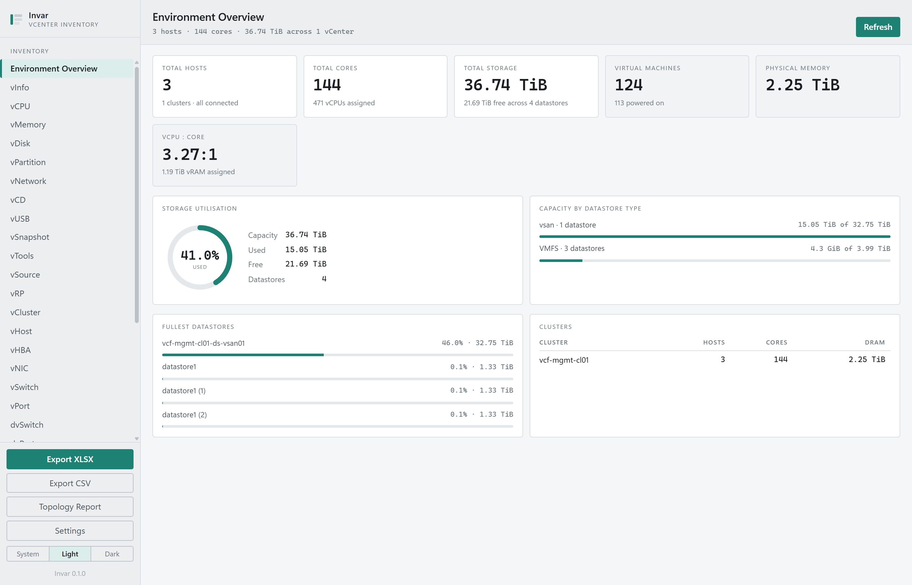
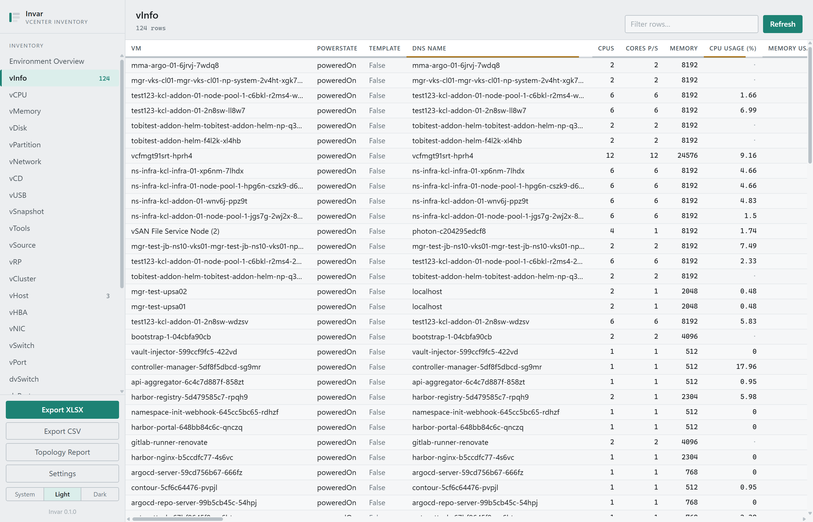
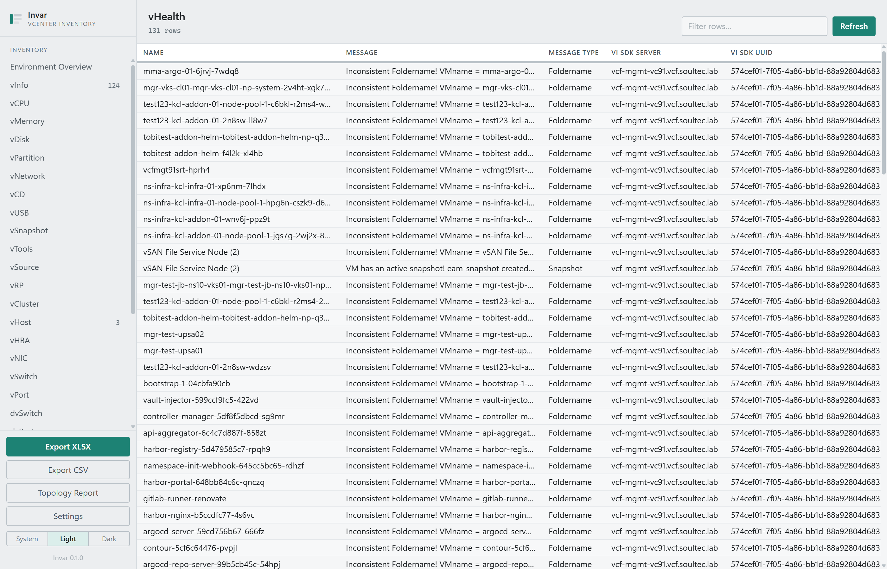
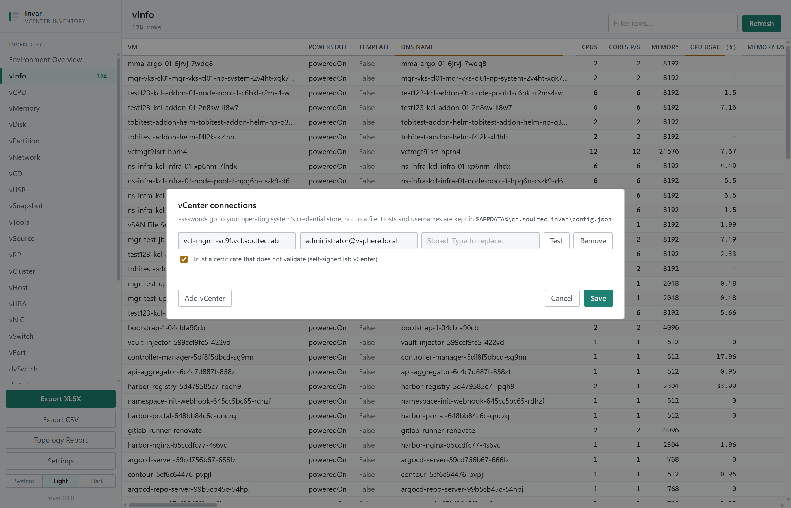

<div align="center">

# Invar

<p>
  A cross-platform vCenter inventory tool. Read your VMware estate, sort it,
  and export it in RVTools' format, on macOS, Windows or Linux.
</p>

</div>

---

## What it does

Invar connects to one or more VMware vCenter servers, reads the inventory, and
shows it as sortable, filterable tables: one per object type. It exports to a
multi-sheet `.xlsx` workbook or to CSV, using RVTools' own sheet and column
names, so anything that already parses an RVTools export keeps working.

RVTools is Windows-only. Invar is not.

**All 27 RVTools sheets are implemented:** vInfo, vCPU, vMemory, vDisk,
vPartition, vNetwork, vCD, vUSB, vSnapshot, vTools, vSource, vRP, vCluster,
vHost, vHBA, vNIC, vSwitch, vPort, dvSwitch, dvPort, vSC_VMK, vDatastore,
vMultiPath, vFileInfo, vLicense, vHealth and vMetaData.

Alongside the tables it produces an HTML topology report, and a dashboard
summarising capacity and utilisation across every configured vCenter.

## Screenshots

The app has a light and a dark theme, and follows the operating system unless
you pick one with the System / Light / Dark switch in the sidebar. These images
follow your GitHub theme the same way.

**Environment Overview**: capacity and utilisation across every configured vCenter.

<picture>
  <source media="(prefers-color-scheme: dark)" srcset="docs/screenshots/overview-dark.png">
  
</picture>

**vInfo**: one sortable, filterable table per RVTools sheet. The hairline under
each column header shows how much of that column vCenter actually populated.

<picture>
  <source media="(prefers-color-scheme: dark)" srcset="docs/screenshots/vinfo-dark.png">
  
</picture>

**vHealth**: RVTools' health checks, computed from the inventory already read.

<picture>
  <source media="(prefers-color-scheme: dark)" srcset="docs/screenshots/vhealth-dark.png">
  
</picture>

**Settings**: several vCenters at once, with passwords kept in the OS credential store.

<picture>
  <source media="(prefers-color-scheme: dark)" srcset="docs/screenshots/settings-dark.png">
  
</picture>

## Install

Download the build for your platform from the
[Releases](https://github.com/virtualFrog/Invar/releases) page.

| Platform | File |
|---|---|
| macOS | `Invar_<version>_universal.dmg` (Apple silicon and Intel) |
| Windows | `Invar_<version>_x64-setup.exe`, or the `.msi` — see below |
| Linux | `.deb`, `.rpm` or `.AppImage` |

On Windows the two installers differ in more than packaging. The
`-setup.exe` installs **per user** into `%LOCALAPPDATA%` and needs **no
administrator rights**; the `.msi` installs **per machine** into
`C:\Program Files` and **requires elevation**, which makes it the one for Group
Policy or Intune. If you are not a local administrator, take the `-setup.exe`.

Each release also ships `invar-export`, the headless exporter, as a standalone
binary for each platform. It is also installed alongside the desktop app on
Windows, though neither installer puts it on `PATH`.

Linux packages need `libwebkit2gtk-4.1-0` and `libgtk-3-0`, which the `.deb` and
`.rpm` declare as dependencies.

## Multiple vCenters

Invar was built for more than one server from the start. Add as many as you
like in Settings; every sheet concatenates their rows and tags each one with the
vCenter it came from, in the `VI SDK Server` column that RVTools also uses.

If one vCenter is unreachable, the others still report. The missing one is named
in a warning above the table rather than being quietly left out, because a short
inventory that looks complete is the worst outcome an inventory tool can produce.

## Credentials and certificates

Two things worth knowing before you point this at production.

**Passwords are not kept in a file.** They go to the operating system's
credential store: Keychain on macOS, Credential Manager on Windows, Secret
Service on Linux. `config.json` holds only hosts, usernames and the certificate
policy, and the app never sends a stored password back to its own UI.

**Certificate verification is on by default.** A lab vCenter with a self-signed
certificate needs the per-connection "trust a certificate that does not
validate" checkbox in Settings. It is off unless you turn it on, per connection.

## Scheduled and headless exports

`invar-export` runs the same export with no window, which is how you put it in
cron, a systemd timer or a scheduled task.

```bash
# Everything, to a workbook
invar-export --xlsx /srv/inventory/$(date +%F).xlsx

# One CSV per sheet, into a directory
invar-export --csv /srv/inventory/today

# Just the sheets you need
invar-export --xlsx out.xlsx --sheets vInfo,vHost,vDatastore
```

It reads the same `config.json` the desktop app writes, so a vCenter configured
once is configured for both. On a server with no credential store, supply
passwords through the environment instead:

```bash
INVAR_PASSWORD_1='…' invar-export --csv /srv/inventory/today
```

`INVAR_PASSWORD_<n>` is 1-based and follows the order of the connections in
`config.json`. Exit status is `0` for a clean run, `1` if nothing was produced,
and `2` if the export was written but a vCenter reported a warning, so a
scheduled job can tell a complete inventory from a partial one.

Run `invar-export --help` for the rest.

`vFileInfo` is left out of exports unless you ask for it: in the desktop app it
is fetched only when you open that sheet, and `invar-export` includes it only
with `--include-file-info`. It walks datastore filesystems rather than reading
inventory vCenter already holds, and a large vSAN datastore can take longer than
anyone wants a nightly job to take.

## Build from source

Needs [Rust](https://rustup.rs) 1.88 or newer and Node 20 or newer.

```bash
npm install
npm run tauri dev      # run it
npm run tauri build    # produce an installer for the current platform
```

`tauri build` only ever builds for the platform you are on. Windows and Linux
installers come out of the release workflow in `.github/workflows/release.yml`.
Windows-specific setup is written up in [`docs/RUNNING-ON-WINDOWS.md`](docs/RUNNING-ON-WINDOWS.md).

The stack is Tauri v2 with a Rust backend and a plain HTML, CSS and vanilla
JavaScript frontend. No framework, no build step for the UI.

## Documentation

| | |
|---|---|
| [`docs/PARITY-PLAN.md`](docs/PARITY-PLAN.md) | What is built, what is left, and why |
| [`docs/RVTOOLS-SHEETS-AND-COLUMNS.md`](docs/RVTOOLS-SHEETS-AND-COLUMNS.md) | All 27 sheets with exact column names |
| [`docs/VCENTER-PROPERTY-REFERENCE.md`](docs/VCENTER-PROPERTY-REFERENCE.md) | Verified vim25 property paths |
| [`docs/LAB-ENVIRONMENT.md`](docs/LAB-ENVIRONMENT.md) | The lab this is developed against |
| [`docs/RUNNING-ON-WINDOWS.md`](docs/RUNNING-ON-WINDOWS.md) | Prerequisites and troubleshooting on Windows |
| [`docs/RELEASING.md`](docs/RELEASING.md) | Cutting a release, and the signing secrets it needs |

## Licence

GNU General Public License v3.0 or later. See [`LICENSE`](LICENSE).

Originally forked from
[dalehassinger/VMware-Explore-Hackathon-2026-Live](https://github.com/dalehassinger/VMware-Explore-Hackathon-2026-Live)
and rewritten.
